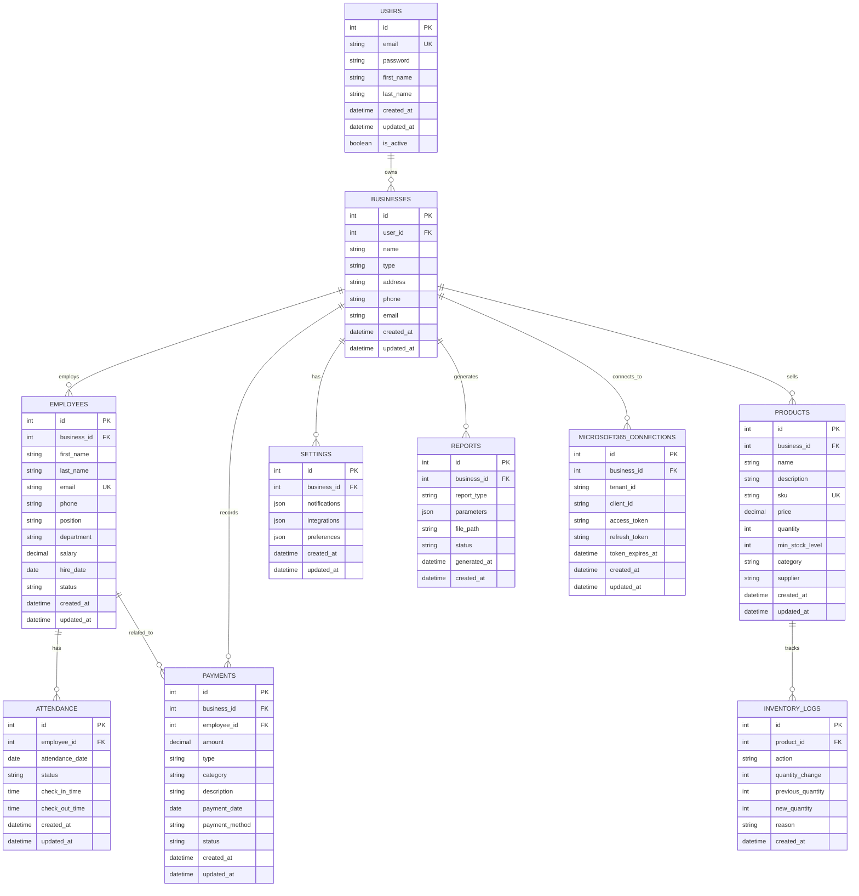

# Database Schema Documentation

## Entity Relationship Diagram



## Table Schemas

### Users Table
```sql
CREATE TABLE users (
    id SERIAL PRIMARY KEY,
    email VARCHAR(255) UNIQUE NOT NULL,
    password VARCHAR(255) NOT NULL,
    first_name VARCHAR(100),
    last_name VARCHAR(100),
    created_at TIMESTAMP DEFAULT CURRENT_TIMESTAMP,
    updated_at TIMESTAMP DEFAULT CURRENT_TIMESTAMP,
    is_active BOOLEAN DEFAULT true
);

CREATE INDEX idx_users_email ON users(email);
CREATE INDEX idx_users_active ON users(is_active);
```

### Businesses Table
```sql
CREATE TABLE businesses (
    id SERIAL PRIMARY KEY,
    user_id INTEGER REFERENCES users(id) ON DELETE CASCADE,
    name VARCHAR(255) NOT NULL,
    type VARCHAR(50) NOT NULL,
    address TEXT,
    phone VARCHAR(20),
    email VARCHAR(255),
    created_at TIMESTAMP DEFAULT CURRENT_TIMESTAMP,
    updated_at TIMESTAMP DEFAULT CURRENT_TIMESTAMP
);

CREATE INDEX idx_businesses_user_id ON businesses(user_id);
CREATE INDEX idx_businesses_type ON businesses(type);
```

### Employees Table
```sql
CREATE TABLE employees (
    id SERIAL PRIMARY KEY,
    business_id INTEGER REFERENCES businesses(id) ON DELETE CASCADE,
    first_name VARCHAR(100) NOT NULL,
    last_name VARCHAR(100) NOT NULL,
    email VARCHAR(255) UNIQUE NOT NULL,
    phone VARCHAR(20),
    position VARCHAR(100),
    department VARCHAR(100),
    salary DECIMAL(10,2),
    hire_date DATE,
    status VARCHAR(20) DEFAULT 'active',
    created_at TIMESTAMP DEFAULT CURRENT_TIMESTAMP,
    updated_at TIMESTAMP DEFAULT CURRENT_TIMESTAMP
);

CREATE INDEX idx_employees_business_id ON employees(business_id);
CREATE INDEX idx_employees_email ON employees(email);
CREATE INDEX idx_employees_status ON employees(status);
CREATE INDEX idx_employees_department ON employees(department);
```

### Attendance Table
```sql
CREATE TABLE attendance (
    id SERIAL PRIMARY KEY,
    employee_id INTEGER REFERENCES employees(id) ON DELETE CASCADE,
    attendance_date DATE NOT NULL,
    status VARCHAR(20) NOT NULL,
    check_in_time TIME,
    check_out_time TIME,
    created_at TIMESTAMP DEFAULT CURRENT_TIMESTAMP,
    updated_at TIMESTAMP DEFAULT CURRENT_TIMESTAMP
);

CREATE INDEX idx_attendance_employee_id ON attendance(employee_id);
CREATE INDEX idx_attendance_date ON attendance(attendance_date);
CREATE INDEX idx_attendance_status ON attendance(status);
CREATE UNIQUE INDEX idx_attendance_employee_date ON attendance(employee_id, attendance_date);
```

### Products Table
```sql
CREATE TABLE products (
    id SERIAL PRIMARY KEY,
    business_id INTEGER REFERENCES businesses(id) ON DELETE CASCADE,
    name VARCHAR(255) NOT NULL,
    description TEXT,
    sku VARCHAR(100) UNIQUE NOT NULL,
    price DECIMAL(10,2) NOT NULL,
    quantity INTEGER DEFAULT 0,
    min_stock_level INTEGER DEFAULT 0,
    category VARCHAR(100),
    supplier VARCHAR(255),
    created_at TIMESTAMP DEFAULT CURRENT_TIMESTAMP,
    updated_at TIMESTAMP DEFAULT CURRENT_TIMESTAMP
);

CREATE INDEX idx_products_business_id ON products(business_id);
CREATE INDEX idx_products_sku ON products(sku);
CREATE INDEX idx_products_category ON products(category);
CREATE INDEX idx_products_low_stock ON products(business_id, quantity) WHERE quantity <= min_stock_level;
```

### Inventory Logs Table
```sql
CREATE TABLE inventory_logs (
    id SERIAL PRIMARY KEY,
    product_id INTEGER REFERENCES products(id) ON DELETE CASCADE,
    action VARCHAR(50) NOT NULL,
    quantity_change INTEGER NOT NULL,
    previous_quantity INTEGER NOT NULL,
    new_quantity INTEGER NOT NULL,
    reason TEXT,
    created_at TIMESTAMP DEFAULT CURRENT_TIMESTAMP
);

CREATE INDEX idx_inventory_logs_product_id ON inventory_logs(product_id);
CREATE INDEX idx_inventory_logs_action ON inventory_logs(action);
CREATE INDEX idx_inventory_logs_created_at ON inventory_logs(created_at);
```

### Payments Table
```sql
CREATE TABLE payments (
    id SERIAL PRIMARY KEY,
    business_id INTEGER REFERENCES businesses(id) ON DELETE CASCADE,
    employee_id INTEGER REFERENCES employees(id) ON DELETE SET NULL,
    amount DECIMAL(10,2) NOT NULL,
    type VARCHAR(20) NOT NULL,
    category VARCHAR(50),
    description TEXT,
    payment_date DATE NOT NULL,
    payment_method VARCHAR(50),
    status VARCHAR(20) DEFAULT 'pending',
    created_at TIMESTAMP DEFAULT CURRENT_TIMESTAMP,
    updated_at TIMESTAMP DEFAULT CURRENT_TIMESTAMP
);

CREATE INDEX idx_payments_business_id ON payments(business_id);
CREATE INDEX idx_payments_employee_id ON payments(employee_id);
CREATE INDEX idx_payments_type ON payments(type);
CREATE INDEX idx_payments_date ON payments(payment_date);
CREATE INDEX idx_payments_status ON payments(status);
```

### Settings Table
```sql
CREATE TABLE settings (
    id SERIAL PRIMARY KEY,
    business_id INTEGER REFERENCES businesses(id) ON DELETE CASCADE,
    notifications JSONB DEFAULT '{}',
    integrations JSONB DEFAULT '{}',
    preferences JSONB DEFAULT '{}',
    created_at TIMESTAMP DEFAULT CURRENT_TIMESTAMP,
    updated_at TIMESTAMP DEFAULT CURRENT_TIMESTAMP
);

CREATE INDEX idx_settings_business_id ON settings(business_id);
CREATE UNIQUE INDEX idx_settings_business_unique ON settings(business_id);
```

### Reports Table
```sql
CREATE TABLE reports (
    id SERIAL PRIMARY KEY,
    business_id INTEGER REFERENCES businesses(id) ON DELETE CASCADE,
    report_type VARCHAR(50) NOT NULL,
    parameters JSONB DEFAULT '{}',
    file_path VARCHAR(500),
    status VARCHAR(20) DEFAULT 'pending',
    generated_at TIMESTAMP,
    created_at TIMESTAMP DEFAULT CURRENT_TIMESTAMP
);

CREATE INDEX idx_reports_business_id ON reports(business_id);
CREATE INDEX idx_reports_type ON reports(report_type);
CREATE INDEX idx_reports_status ON reports(status);
```

### Microsoft 365 Connections Table
```sql
CREATE TABLE microsoft365_connections (
    id SERIAL PRIMARY KEY,
    business_id INTEGER REFERENCES businesses(id) ON DELETE CASCADE,
    tenant_id VARCHAR(255) NOT NULL,
    client_id VARCHAR(255) NOT NULL,
    access_token TEXT,
    refresh_token TEXT,
    token_expires_at TIMESTAMP,
    created_at TIMESTAMP DEFAULT CURRENT_TIMESTAMP,
    updated_at TIMESTAMP DEFAULT CURRENT_TIMESTAMP
);

CREATE INDEX idx_microsoft365_business_id ON microsoft365_connections(business_id);
CREATE UNIQUE INDEX idx_microsoft365_business_unique ON microsoft365_connections(business_id);
```

## Performance Indexes

### Additional Performance Indexes
```sql
-- Composite indexes for common queries
CREATE INDEX idx_products_business_category ON products(business_id, category);
CREATE INDEX idx_employees_business_department ON employees(business_id, department);
CREATE INDEX idx_payments_business_date ON payments(business_id, payment_date);
CREATE INDEX idx_attendance_employee_date_range ON attendance(employee_id, attendance_date DESC);

-- Full text search indexes
CREATE INDEX idx_products_name_fts ON products USING gin(to_tsvector('english', name));
CREATE INDEX idx_products_description_fts ON products USING gin(to_tsvector('english', description));
CREATE INDEX idx_employees_name_fts ON employees USING gin(to_tsvector('english', first_name || ' ' || last_name));

-- JSONB indexes for settings and reports
CREATE INDEX idx_settings_notifications ON settings USING gin(notifications);
CREATE INDEX idx_reports_parameters ON reports USING gin(parameters);
```

## Database Views

### Business Summary View
```sql
CREATE VIEW business_summary AS
SELECT 
    b.id as business_id,
    b.name as business_name,
    COUNT(DISTINCT e.id) as total_employees,
    COUNT(DISTINCT p.id) as total_products,
    COUNT(DISTINCT pay.id) as total_payments,
    COALESCE(SUM(pay.amount), 0) as total_payment_amount,
    COUNT(DISTINCT CASE WHEN p.quantity <= p.min_stock_level THEN p.id END) as low_stock_products
FROM businesses b
LEFT JOIN employees e ON b.id = e.business_id
LEFT JOIN products p ON b.id = p.business_id
LEFT JOIN payments pay ON b.id = pay.business_id
GROUP BY b.id, b.name;
```

### Employee Attendance Summary View
```sql
CREATE VIEW employee_attendance_summary AS
SELECT 
    e.id as employee_id,
    e.first_name,
    e.last_name,
    e.business_id,
    COUNT(CASE WHEN a.status = 'present' THEN 1 END) as days_present,
    COUNT(CASE WHEN a.status = 'absent' THEN 1 END) as days_absent,
    COUNT(CASE WHEN a.status = 'late' THEN 1 END) as days_late,
    AVG(CASE WHEN a.check_out_time IS NOT NULL AND a.check_in_time IS NOT NULL 
         THEN EXTRACT(EPOCH FROM (a.check_out_time - a.check_in_time))/3600 
         END) as avg_hours_worked
FROM employees e
LEFT JOIN attendance a ON e.id = a.employee_id
GROUP BY e.id, e.first_name, e.last_name, e.business_id;
```

### Monthly Payment Summary View
```sql
CREATE VIEW monthly_payment_summary AS
SELECT 
    business_id,
    DATE_TRUNC('month', payment_date) as month,
    type,
    COUNT(*) as transaction_count,
    SUM(amount) as total_amount,
    AVG(amount) as avg_amount
FROM payments
GROUP BY business_id, DATE_TRUNC('month', payment_date), type;
```

## Database Triggers

### Update Timestamps Trigger
```sql
CREATE OR REPLACE FUNCTION update_updated_at_column()
RETURNS TRIGGER AS $$
BEGIN
    NEW.updated_at = CURRENT_TIMESTAMP;
    RETURN NEW;
END;
$$ language 'plpgsql';

CREATE TRIGGER update_users_updated_at BEFORE UPDATE ON users
    FOR EACH ROW EXECUTE FUNCTION update_updated_at_column();

CREATE TRIGGER update_businesses_updated_at BEFORE UPDATE ON businesses
    FOR EACH ROW EXECUTE FUNCTION update_updated_at_column();

CREATE TRIGGER update_employees_updated_at BEFORE UPDATE ON employees
    FOR EACH ROW EXECUTE FUNCTION update_updated_at_column();

CREATE TRIGGER update_products_updated_at BEFORE UPDATE ON products
    FOR EACH ROW EXECUTE FUNCTION update_updated_at_column();

CREATE TRIGGER update_payments_updated_at BEFORE UPDATE ON payments
    FOR EACH ROW EXECUTE FUNCTION update_updated_at_column();

CREATE TRIGGER update_settings_updated_at BEFORE UPDATE ON settings
    FOR EACH ROW EXECUTE FUNCTION update_updated_at_column();

CREATE TRIGGER update_microsoft365_connections_updated_at BEFORE UPDATE ON microsoft365_connections
    FOR EACH ROW EXECUTE FUNCTION update_updated_at_column();
```

### Inventory Log Trigger
```sql
CREATE OR REPLACE FUNCTION log_inventory_change()
RETURNS TRIGGER AS $$
BEGIN
    IF TG_OP = 'UPDATE' AND NEW.quantity != OLD.quantity THEN
        INSERT INTO inventory_logs (product_id, action, quantity_change, previous_quantity, new_quantity, reason)
        VALUES (NEW.id, 'update', NEW.quantity - OLD.quantity, OLD.quantity, NEW.quantity, 'Manual update');
    END IF;
    RETURN NEW;
END;
$$ language 'plpgsql';

CREATE TRIGGER inventory_change_log AFTER UPDATE ON products
    FOR EACH ROW EXECUTE FUNCTION log_inventory_change();
```

## Database Constraints

### Check Constraints
```sql
ALTER TABLE employees ADD CONSTRAINT check_salary_positive CHECK (salary > 0);
ALTER TABLE products ADD CONSTRAINT check_price_positive CHECK (price > 0);
ALTER TABLE products ADD CONSTRAINT check_quantity_non_negative CHECK (quantity >= 0);
ALTER TABLE products ADD CONSTRAINT check_min_stock_non_negative CHECK (min_stock_level >= 0);
ALTER TABLE payments ADD CONSTRAINT check_amount_positive CHECK (amount > 0);
ALTER TABLE attendance ADD CONSTRAINT check_checkout_after_checkin CHECK (
    check_out_time IS NULL OR check_in_time IS NULL OR check_out_time > check_in_time
);
```

### Foreign Key Constraints with Cascade
```sql
ALTER TABLE businesses 
    ADD CONSTRAINT fk_businesses_user 
    FOREIGN KEY (user_id) REFERENCES users(id) ON DELETE CASCADE;

ALTER TABLE employees 
    ADD CONSTRAINT fk_employees_business 
    FOREIGN KEY (business_id) REFERENCES businesses(id) ON DELETE CASCADE;

ALTER TABLE products 
    ADD CONSTRAINT fk_products_business 
    FOREIGN KEY (business_id) REFERENCES businesses(id) ON DELETE CASCADE;

ALTER TABLE payments 
    ADD CONSTRAINT fk_payments_business 
    FOREIGN KEY (business_id) REFERENCES businesses(id) ON DELETE CASCADE;

ALTER TABLE attendance 
    ADD CONSTRAINT fk_attendance_employee 
    FOREIGN KEY (employee_id) REFERENCES employees(id) ON DELETE CASCADE;

ALTER TABLE inventory_logs 
    ADD CONSTRAINT fk_inventory_logs_product 
    FOREIGN KEY (product_id) REFERENCES products(id) ON DELETE CASCADE;
```