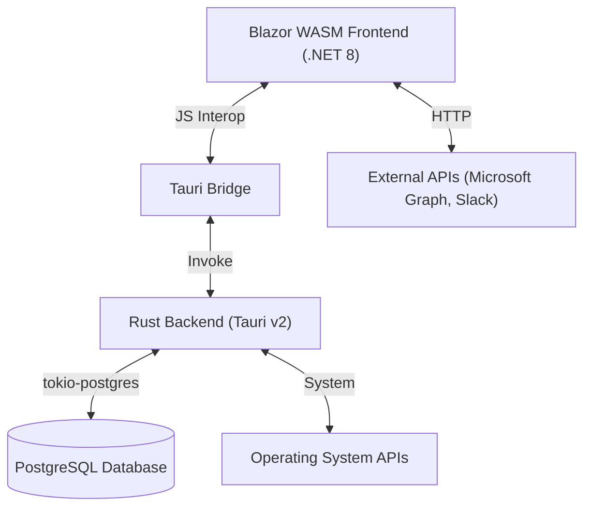

# Technical Stack & Architecture

## 1. System Architecture

The Planning Bord follows a **Hybrid Desktop Architecture**, leveraging WebAssembly for the UI and Rust for system-level operations, creating a high-performance, offline-first ERP solution.

### Components
-   **Frontend (UI):** Built with **Blazor WebAssembly (.NET 8)**. Handles all user interaction, state management, and view rendering.
    -   **Styling:** **Tailwind CSS** for utility-first styling, configured with a custom theme switcher (Dark/Light mode).
    -   **State:** In-memory state managed by Scoped Services.
-   **Backend (Core):** Built with **Rust (Tauri v2)**. Handles data persistence, file system access, and heavy computations.
    -   **Database:** **PostgreSQL** (managed via `tokio-postgres` and `postgres` crate).
    -   **Concurrency:** Asynchronous runtime via `tokio`.
    -   **Commands:** Exposed via `#[tauri::command]` macros.

## 2. Component Specifications

### Frontend Services (C#)
All services are registered in `Program.cs` as `Scoped` services.

| Service | Responsibility |
| :--- | :--- |
| **InventoryService** | Product management, Stock levels, BOM/Recipes, Velocity Reports. |
| **HrService** | Employee records, Role management. |
| **TimeTrackingService** | Clock-in/out logic, Attendance history, "Late/Early" detection. |
| **ProjectService** | Project lifecycle, Gantt chart data, Task management. |
| **ResourcePlanningService** | Allocation of employees and tools to projects. |
| **FinanceService** | General Ledger, Accounts, Transactions, Financial Reports. |
| **SalesService** | Sales Orders, Invoices, Quotes. |
| **PurchaseOrderService** | Procurement workflows, Supplier management. |
| **ClientService** | CRM functionality, Client database. |
| **IntegrationService** | Managing connections to external providers (Microsoft, Slack). |
| **NotificationService** | Toast notifications and system alerts. |

### Backend Commands (Rust)
Rust functions exposed to the frontend via Tauri's IPC mechanism.

| Category | Commands (Examples) |
| :--- | :--- |
| **Auth** | `login`, `generate_invite_token`, `check_invite_token` |
| **Inventory** | `get_products`, `update_stock`, `get_velocity_report`, `manage_bom` |
| **Supply Chain** | `create_purchase_order`, `receive_stock_batch` |
| **HR** | `clock_in`, `clock_out`, `get_attendances`, `update_employee_role` |
| **Projects** | `get_projects`, `assign_resource`, `get_project_profitability` |
| **Finance** | `get_gl_accounts`, `post_journal_entry`, `get_cashflow` |
| **System** | `get_audit_logs`, `export_database`, `get_setup_status` |

## 3. Data Persistence & Schema

The application uses **PostgreSQL** as its primary data store. Schema evolution is managed via SQL migration files located in `src-tauri/migrations/postgres/`.

### Key Schema Modules

1.  **Core & Auth:**
    -   `users`, `roles`, `permissions`: RBAC system.
    -   `audit_logs`: Tracking user actions (Create/Update/Delete).

2.  **Inventory & Supply Chain:**
    -   `products`: Base inventory items.
    -   `inventory_batches`: FIFO/LIFO tracking with expiration dates.
    -   `bom_recipes`: Bill of Materials for manufactured items.
    -   `suppliers`, `purchase_orders`: Procurement.

3.  **ERP & Finance:**
    -   `gl_accounts`: Chart of accounts (Assets, Liabilities, Equity, Revenue, Expenses).
    -   `journal_entries`: Double-entry bookkeeping records.
    -   `sales_orders`, `invoices`: Revenue generation.

4.  **Projects:**
    -   `projects`, `tasks`: Work breakdown.
    -   `project_assignments`: Resource allocation.
    -   `time_entries`: Billable/Non-billable hours.

## 4. Deployment & Build Process

### Production Build
The release build process bundles the Blazor WASM assets directly into the Rust executable.

1.  **Frontend Build:**
    -   Tailwind CSS is compiled: `npx tailwindcss -i ./src/styles.css -o ./src/wwwroot/css/app.css`
    -   Blazor app is published: `dotnet publish -c Release -o dist`

2.  **Backend Build:**
    -   Tauri bundles the `dist` folder.
    -   Rust code is compiled in release mode: `cargo tauri build`

### Version Control
-   **Git:** Source code management.
-   **Ignored Files:** `bin/`, `obj/`, `dist/`, `target/`, `.vs/`, `node_modules/`.

## 5. Maintenance Guidelines

-   **Database Migrations:**
    -   New features requiring schema changes must add a new SQL file in `src-tauri/migrations/postgres/` (e.g., `010_new_feature.sql`).
    -   The `postgres_init.rs` module automatically applies pending migrations on startup.

-   **Dependency Updates:**
    -   **.NET:** `dotnet add package <PackageName>`
    -   **Rust:** `cargo update`
    -   **NPM:** `npm update` (for Tailwind)
