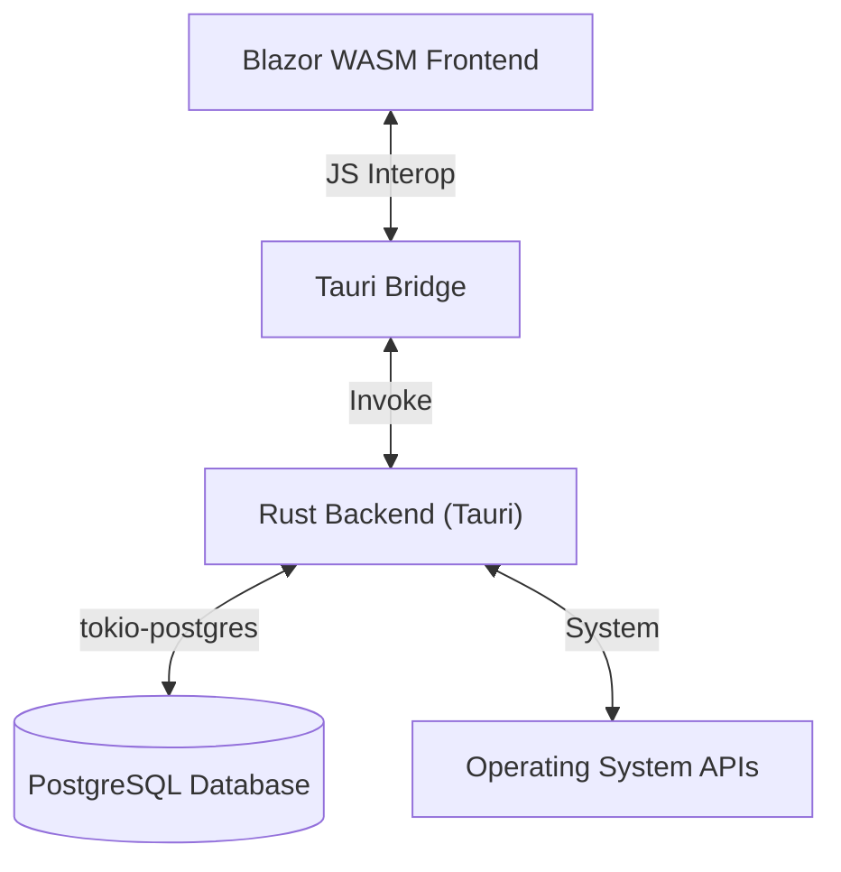

# Technical Stack & Architecture

## 1. System Architecture

The Planning Bord follows a **Hybrid Desktop Architecture**, leveraging WebAssembly for the UI and Rust for system-level operations.



### Components
-   **Frontend (UI):** Built with Blazor WebAssembly (.NET 8). Handles all user interaction, state management, and view rendering.
    -   **Styling:** Tailwind CSS for utility-first styling.
    -   **State:** In-memory state managed by Scoped Services.
-   **Backend (Core):** Built with Rust (Tauri). Handles data persistence, file system access, and heavy computations.
    -   **Database:** PostgreSQL (managed via `tokio-postgres` and `postgres` crate).
    -   **Abstraction:** Uses a `Database` trait to decouple logic from the specific database implementation.
    -   **Commands:** Exposed via `#[tauri::command]` macros.

## 2. Component Specifications

### Frontend Services (C#)
All services are registered in `Program.cs` as `Scoped` services and implement specific interfaces for modularity.

| Service | Interface | Responsibility |
| :--- | :--- | :--- |
| **ComplaintService** | `IComplaintService` | Anonymous complaint submission and resolution. |
| **ReportService** | `IReportService` | Generating summaries and chart data. |
| **ProjectService** | `IProjectService` | Project lifecycle and team management. |
| **IntegrationService** | `IIntegrationService` | External API integrations (Microsoft 365). |
| **UserService** | `IUserService` | User accounts, invites, and profile management. |
| **MicrosoftGraphService** | N/A | Direct communication with Microsoft Graph API. |

### Backend Commands (Rust)
Rust functions exposed to the frontend via Tauri's IPC mechanism. Defined in `src-tauri/src/lib.rs`.

| Category | Commands (Examples) |
| :--- | :--- |
| **Auth** | `login`, `generate_invite_token`, `check_invite_token`, `accept_invite` |
| **Inventory** | `get_products`, `add_product`, `update_product`, `delete_product` |
| **HR** | `get_employees`, `clock_in`, `clock_out`, `get_attendances` |
| **Projects** | `get_projects`, `add_project_task`, `assign_project_employee`, `get_project_assignments` |
| **Finance** | `get_accounts`, `create_invoice`, `get_payments`, `get_monthly_cashflow` |
| **System** | `get_audit_logs`, `get_setup_status`, `save_db_config`, `get_dashboard_stats` |
| **Integrations** | `get_integrations`, `configure_integration`, `seed_demo_data` |

## 3. Data Flow

### Example: Fetching Products
1.  **User Action:** User navigates to `Inventory.razor`.
2.  **Service Call:** Component calls `InventoryService.GetProductsAsync()`.
3.  **IPC Bridge:** Service invokes `__TAURI__.core.invoke("get_products", args)`.
4.  **Rust Execution:**
    -   Tauri routes the call to the `get_products` function in `lib.rs`.
    -   Rust executes a SQL query using `postgres` client.
    -   Results are serialized to JSON.
5.  **Response:** JSON data is returned to Blazor, deserialized into `PagedResult<Product>`, and rendered.

## 4. API Documentation

### Common Patterns
-   **Pagination:** Many "Get" endpoints return a `PagedResult<T>` containing `Items`, `Total`, `Page`, and `PageSize`.
-   **Error Handling:** Rust functions return `Result<T, String>`. Errors are caught in C# services and logged or displayed via `NotificationService`.

### Database Schema (PostgreSQL)
Key tables include:
-   `products`: Inventory items.
-   `employees`: HR records.
-   `attendances`: Clock-in/out logs.
-   `tasks`: Workflow tasks.
-   `users` / `invites`: Authentication and user management.
-   `roles` / `permissions` / `role_permissions`: RBAC configuration.
-   `projects` / `project_tasks` / `project_assignments`: Project management.
-   `tools` / `tool_assignments`: Tool tracking.
-   `accounts` / `invoices` / `payments`: Finance module.
-   `audit_logs`: System activity tracking.
-   `setup_config` / `dashboard_configs`: System configuration.

## 5. Deployment Procedures

### Production Build
The release build process bundles the Blazor WASM assets directly into the Rust executable.

1.  **Publish Frontend:**
    ```powershell
    dotnet publish -c Release src/ThePlanningBord.csproj -o dist
    ```
    *Output:* `dist/wwwroot` containing optimized WASM files.

2.  **Build Backend:**
    ```powershell
    cd src-tauri
    cargo build --release
    ```
    *Output:* `src-tauri/target/release/the-planning-bord.exe`

### Version Control
-   **Git:** Source code management.
-   **Ignored Files:** `bin/`, `obj/`, `dist/`, `target/`, `.vs/`.

## 6. Maintenance Guidelines

-   **Database Migrations:** Schema initialization is handled in `db/postgres_init.rs`. It creates tables if they don't exist.
-   **Dependency Updates:**
    -   .NET: Update NuGet packages via `dotnet add package`.
    -   Rust: Update crates via `cargo update`.
    -   NPM: Update Tailwind via `npm update`.
